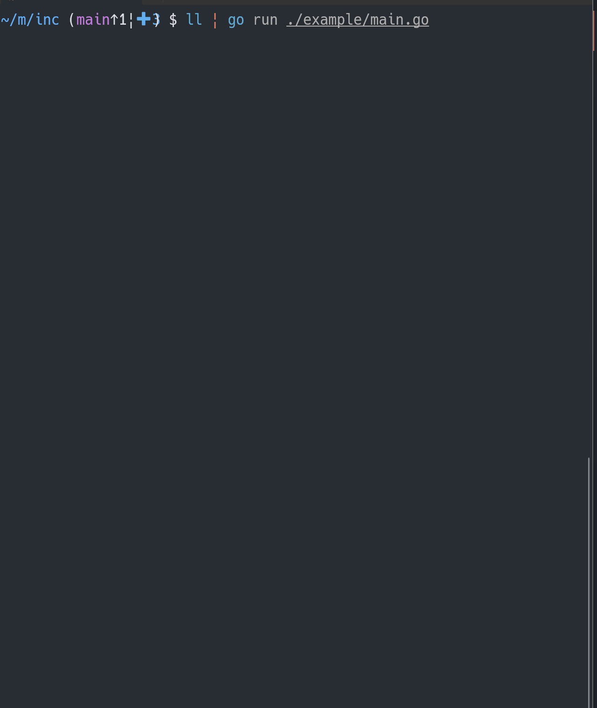

# inc

inc is a (headless) incremental text search library.



## install

`go get -u github.com/tbistr/inc`

## Usage

[For more information, see godoc](https://pkg.go.dev/github.com/tbistr/inc).

```golang
// initialize with the initial query and the target strings
// Strs2Cands converts []string to []inc.Candidate
target := []string{"foobar", "hogehuga", "bazbar"}
e := inc.New("initial query", inc.Strs2Cands(target))

e.DelQuery()             // delete all runes from the query
e.AddQuery('o')          // add 'o' to the query
fmt.Println(e.Matched()) // ["foobar", "hogehuga"]
e.RmQuery()              // remove the last rune from the query
fmt.Println(e.Matched())

a := struct{ Name string }{Name: "some struct A"}
b := struct{ Name string }{Name: "some struct B"}

// you can get some matched object or pointer
e = inc.New("", []inc.Candidate{
    {Ptr: &a, Text: []rune("abc")},
    {Ptr: &b, Text: []rune("def")},
})

// some query operations

for _, c := range e.Matched() {
    // get matched pointer as *struct{ Name string }
    fmt.Println(c.Ptr.(*struct{ Name string }).Name)
}
```

## What is incremental search?

For the following text,

```golang
[]string{"foobar", "hogehuga", "foobaz"}
```

query `"ob"` matches `"foobar"` and `"foobaz"`.  
Then add `'r'` to the query, it only matches `"foobar"`.  
Remove `'r'` and add `'z'`, it matches `"foobaz"` again.

Like this, incremental search checks

- if the runes in the query are included in the text;
- if the order of the included runes is the same as the query.

But doesn't care about substrings between the runes.

**This is the explanation of the default algorithm of inc.**
You can change the algorithm by implementing `inc.Algorithm` and passing it to `inc.NewWithAlgo`.
